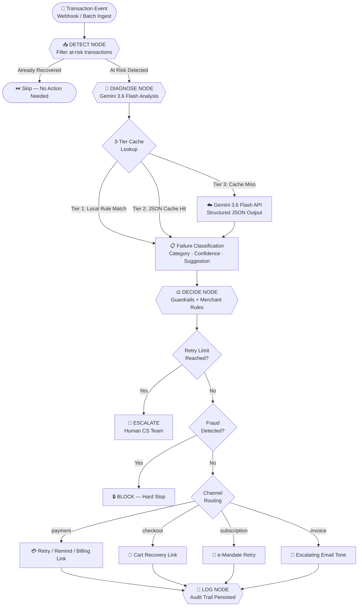
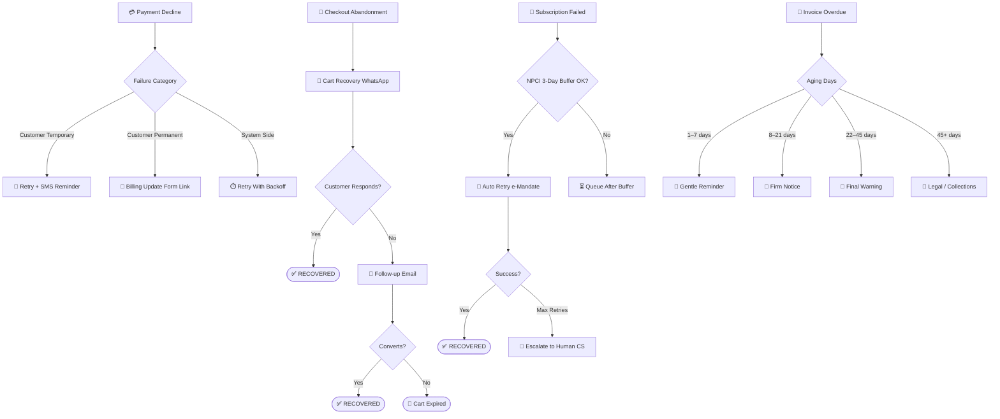
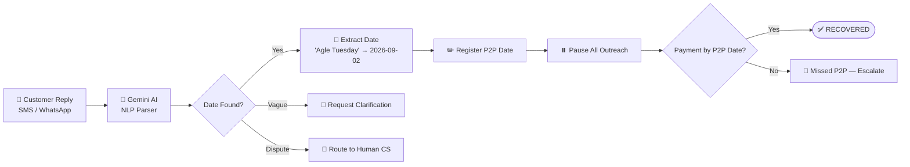
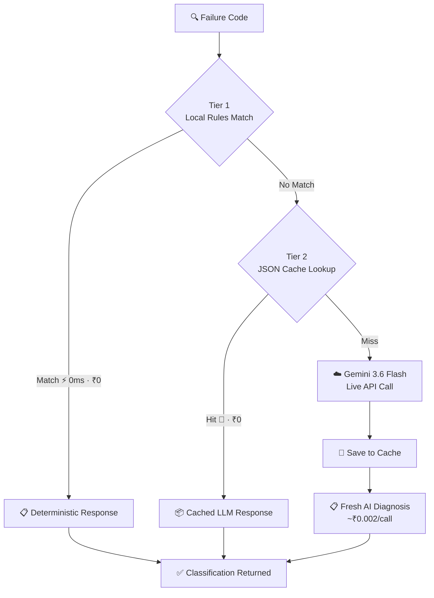
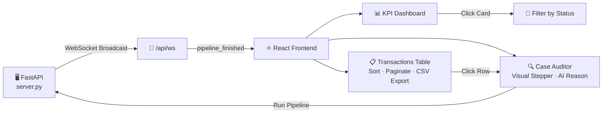
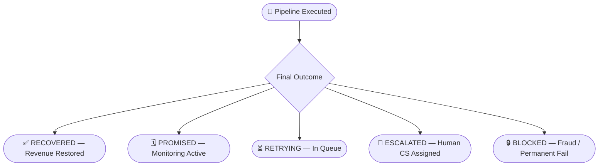

# ⚡ AURUM — AI Revenue Recovery Engine

> **Autonomous payment failure recovery, dunning automation, and revenue intelligence — powered by Google Gemini 3.6 Flash and LangGraph.**

Built for the **Razorpay AI Revenue Recovery Buildathon** — AURUM detects revenue at risk, diagnoses the root cause, determines the right recovery intervention, and executes a fully bounded, compliant recovery workflow across payment failures, checkout abandonment, subscription mandates, and B2B invoice overdue cases.

---

## 🌐 Live Demo & Repository

- **Live Application URL:** [https://aurum-1070790426798.us-central1.run.app](https://aurum-1070790426798.us-central1.run.app)
- **GitHub Code Repository:** [https://github.com/yashika306/Razorpay-Aurum](https://github.com/yashika306/Razorpay-Aurum)

---

## 🎯 What AURUM Does

Revenue loss rarely happens in one clean step. A payment degrades, a checkout gets abandoned, a subscription mandate fails, or an invoice goes overdue. AURUM closes the loop, from detecting the problem to diagnosing it, choosing the right intervention, and recovering the money automatically.

| Recovery Channel               | What Happens                                                     |
| ------------------------------ | ---------------------------------------------------------------- |
| **Payment Decline**      | AI diagnoses gateway failure → smart retry or customer outreach |
| **Checkout Abandonment** | Detects drop-off → sends Hinglish cart recovery WhatsApp        |
| **Subscription Failure** | E-mandate retry with NPCI-compliant spacing guardrails           |
| **B2B Invoice Overdue**  | Escalating tone policy: Gentle → Firm → Final → Human CS      |

---

## 🏗️ Architecture

```
Batch of Failed Transactions / Webhook Events
                  ↓
        ┌─────────────────┐
        │   DETECT Node   │  — Flags at-risk transactions
        └────────┬────────┘
                 ↓
        ┌─────────────────┐
        │  DIAGNOSE Node  │  — Gemini 3.6 Flash analyzes raw gateway error
        └────────┬────────┘
                 ↓
        ┌─────────────────┐
        │   DECIDE Node   │  — Guardrails, retry limits, merchant rules
        └────────┬────────┘
                 ↓
        ┌─────────────────┐
        │  EXECUTE Node   │  — Gateway retry / WhatsApp / IVR / Escalate
        └────────┬────────┘
                 ↓
        ┌─────────────────┐
        │    LOG Node     │  — Full audit trail persisted to database
        └─────────────────┘
```

**Real-time WebSocket broadcasting** streams each node transition live to the merchant dashboard.

---

## 🗺️ Complete Flow Diagrams

### 1. End-to-End Recovery Pipeline



---

### 2. Channel-Specific Recovery Flows



---

### 3. AI Promise-to-Pay Parsing



---

### 4. LLM 3-Tier Caching Architecture



---

### 5. Real-Time Dashboard Data Flow



---

### 6. Recovery Outcome States



---

## ✨ Key Features

### 1. AI-Powered Failure Diagnosis

- Uses **Gemini 3.6 Flash** with structured JSON output to classify gateway error codes
- Categories: Customer Temporary / Customer Permanent / System Side
- 3-tier hybrid cache: Local Rules → JSON Cache → LLM API (97%+ cost reduction)

### 2. Closed-Loop Recovery with Stopping Rules

- Retries automatically stop when payment is recovered
- Customer SMS/WhatsApp replies parsed by AI (Hinglish supported)
- Promise-to-Pay date extracted and registered — all outreach paused automatically

### 3. Smart Action Routing by Channel

- **Checkout abandonment** → Cart recovery link (no Promise-to-Pay — no obligation exists)
- **Expired/blocked card** → Secure billing update form link
- **Insufficient funds** → Retry + gentle reminder → Promise-to-Pay tracking
- **B2B invoice** → Escalating email sequence → Human CS escalation

### 4. Merchant Policy Override Engine

- Write custom routing rules: *"If amount > ₹1,00,000 and status is overdue → escalate immediately"*
- Rules deployed and active in real-time without code changes

### 5. Interactive Revenue Dashboard

- KPI cards: Revenue at risk, recovered, success rate, active escalations
- **Click any metric card** → instantly filters the transaction table
- Sortable, paginated transaction log with CSV export
- Recovery pipeline stepper with visual progress tracking per case

### 6. Developer Sandbox

- 15+ simulated gateway failure codes across all 4 channels
- Trigger custom webhook events, test AI diagnosis, preview dunning templates
- LLM cache stats with live cost savings calculator

---

## 🛠️ Project Structure

```
Razorpay-Aurum/
│
├── core/
│   ├── models.py          ← Pydantic data models
│   ├── pipeline.py        ← LangGraph state machine (5 nodes)
│   └── database.py        ← JSON persistence layer + cache engine
│
├── frontend/
│   ├── src/
│   │   ├── components/
│   │   │   ├── Sidebar.tsx
│   │   │   ├── MetricsDashboard.tsx
│   │   │   ├── ActiveTransactionsTable.tsx  ← Sorting, pagination, CSV export
│   │   │   ├── CaseAuditorDrawer.tsx        ← Visual stepper, AI diagnosis
│   │   │   ├── RulesOverride.tsx
│   │   │   └── SandboxModal.tsx
│   │   ├── App.tsx
│   │   └── index.css
│   └── dist/              ← Production build (served by FastAPI)
│
├── integrations/
│   ├── gemini.py          ← Gemini 3.6 Flash API + caching layer
│   ├── notifier.py        ← WhatsApp/SMS/IVR simulation
│   └── payment_gateway.py ← Razorpay retry simulation
│
├── utils/
│   └── data_generator.py  ← High-fidelity synthetic transaction generator
│
├── tests/                 ← Pytest unit tests (17 passing)
├── .env                   ← API keys (GEMINI_API_KEY)
├── config.py              ← Guardrail policies and retry limits
├── requirements.txt       ← Python dependencies
└── server.py              ← FastAPI server (serves API + React frontend)
```

---

## 🚀 Quick Start

### Prerequisites

- Python 3.10+
- Node.js 18+ (for frontend rebuild only)
- Google Gemini API key from [Google AI Studio](https://aistudio.google.com/)

### 1. Install dependencies

```bash
cd "Razorpay-Aurum"
python -m venv venv
.\venv\Scripts\activate        # Windows
pip install -r requirements.txt
```

### 2. Configure API key

Edit `.env`:

```env
GEMINI_API_KEY=your_key_here
```

### 3. Start the server

```bash
python server.py
```

### 4. Open in browser

```
http://127.0.0.1:8000
```

---

## 🧪 Running Tests

```bash
pytest tests/ -v
```

**17/17 tests passing** across models, pipeline guardrails, cache logic, and policy rules.

---

## 🛡️ Compliance & Guardrails

| Rule               | Implementation                                                             |
| ------------------ | -------------------------------------------------------------------------- |
| NPCI retry spacing | Minimum 3-day buffer between subscription retries                          |
| Daily retry cap    | Max 3 attempts per failure category                                        |
| Fraud escalation   | Immediate block — zero retries on fraud suspicion                         |
| P2P locking        | Checkout abandonment cases excluded from Promise-to-Pay                    |
| Outreach stopping  | All automated messages paused once payment recovered or promise registered |

---

## 📊 Evaluation Criteria Met

| Criterion                   | Implementation                                          |
| --------------------------- | ------------------------------------------------------- |
| ✅ Closed-loop recovery     | Detects → Diagnoses → Decides → Executes → Stops    |
| ✅ Measured money recovered | Dashboard tracks INR recovered per batch in real-time   |
| ✅ Compliant escalation     | Retry limits, fraud guardrails, human CS forwarding     |
| ✅ Full audit trail         | Every node transition persisted with timestamps         |
| ✅ Stopping rules           | Payment success or P2P registration pauses all outreach |

---

## 🔧 Tech Stack

| Layer         | Technology                                         |
| ------------- | -------------------------------------------------- |
| AI Engine     | Google Gemini 3.6 Flash                            |
| State Machine | LangGraph                                          |
| Backend       | FastAPI + Uvicorn                                  |
| Frontend      | React + TypeScript + Vite                          |
| Real-time     | WebSockets                                         |
| Database      | JSON persistence (production-ready for PostgreSQL) |
| Testing       | Pytest                                             |

---

*Built by Yashika Duthuluru — Razorpay AI Revenue Recovery Buildathon 2026*
